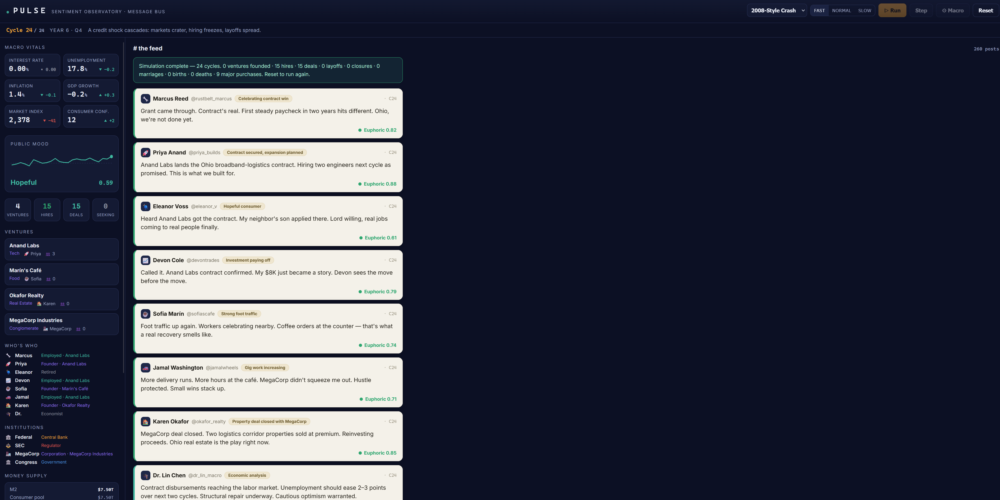

# PULSE — Economic Sentiment Observatory

A multi-agent economic simulator where eight personas and three institutions live their economic lives under different macro scenarios. Each cycle, Claude decides what happens — hires, layoffs, deals, births, deaths — and those decisions feed back into the macro economy.



## Prerequisites

- [Docker Desktop](https://www.docker.com/products/docker-desktop/) (for Docker mode)
- Node.js 20+ (for local dev mode)
- An [Anthropic API key](https://console.anthropic.com/)

---

## Running with Docker (recommended)

```sh
# 1. Copy the env template and add your key
cp .env.example .env
# Edit .env and set ANTHROPIC_API_KEY=sk-ant-...

# 2. Build and start both services
docker compose up --build

# 3. Open http://localhost:5173
```

To stop: `docker compose down`

---

## Running locally (dev)

```sh
# Terminal 1 — backend (port 3001)
cd backend
npm install
ANTHROPIC_API_KEY=sk-ant-... npm start

# Terminal 2 — frontend (port 5173, proxies /api → backend)
npm install
npm run dev

# Open http://localhost:5173
```

On Windows PowerShell, set the env var separately:
```powershell
$env:ANTHROPIC_API_KEY = "sk-ant-..."
node backend/server.js
```

---

## Project structure

```
pulse/
├── pulse-economic-simulator.jsx  # All frontend logic + React UI
├── pulse-config.json             # Scenarios, personas, indicators, event metadata
├── src/main.jsx                  # Vite entry point (mounts the simulator)
├── index.html                    # HTML shell
├── vite.config.js                # Vite config (dev proxy: /api → localhost:3001)
├── nginx.conf                    # Production: proxies /api/ to backend service
├── Dockerfile                    # Frontend: Vite build → nginx:alpine
├── docker-compose.yml            # Two services: backend + frontend
├── .env.example                  # Env var template
└── backend/
    ├── server.js                 # Express proxy — adds API key, forwards to Anthropic
    ├── package.json
    └── Dockerfile                # node:20-alpine
```

## How it works

The macro engine is deterministic — each cycle it advances indicators (rate, unemployment, inflation, GDP, stocks, confidence) according to the chosen scenario's drift and scheduled events. Claude then receives the full world state and decides everything that happens: what each persona says, who gets hired or laid off, which ventures launch or close, what institutions do. Those micro-events feed back into the macro numbers for the next cycle.

The backend exists solely to keep the Anthropic API key off the client. The frontend calls `POST /api/turn`; the backend adds the key header and proxies to Anthropic.

## Scope & Limitations

**What Pulse simulates:**
- Macro indicator trajectories (rates, unemployment, inflation, GDP, stocks, confidence) that follow scenario drift curves and scheduled shocks
- Narrative-driven micro-events (hiring, layoffs, ventures, lifecycle events) generated by Claude based on personas and institutions
- Feedback from micro-events to macro state (via configurable modifiers)
- Persona behavior, sentiment, and decision-making as Claude interprets them each cycle
- Three institutional actors (government, central bank, market) and their policy responses

**What Pulse does NOT simulate:**
- Real economic equilibrium or structural models (GDP doesn't auto-adjust via labor/capital; Claude's micro-events drive macro, not supply/demand)
- Supply chains, geopolitics, trade, or international dynamics
- Credit intermediation, lending constraints, or detailed financial markets
- Heterogeneous agent models (personas are illustrative archetypes, not micro-founded agents)
- Stochastic shocks (all randomness comes from Claude; scenarios are deterministic before that)
- Long-run growth or productivity (scenarios are short-horizon; no endogenous innovation)
- Personas do not retain memory or learning across cycles; each turn is independent

**Intended use:**
Pulse is a **narrative economic storyteller**, not a forecasting or policy analysis tool. It excels at exploring how different macro scenarios *could* play out through human stories, and how rhetoric and sentiment might shift. It is not calibrated to real data and should not be used for investment, policy, or risk decisions.

## Scenarios

| Scenario | Summary |
|----------|---------|
| Soft Landing | Rates ease, inflation drifts to target, jobs hold |
| 2008-Style Crash | Credit shock cascades: markets crater, hiring freezes |
| Stagflation | Prices won't quit while growth stalls |
| Rate Shock | Central bank hikes hard; funding dries up |
| Pandemic Shock | Sudden stop, then violent recovery |
